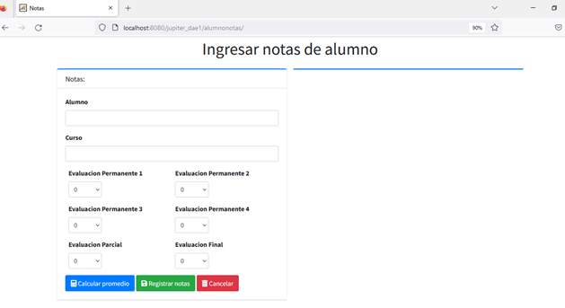
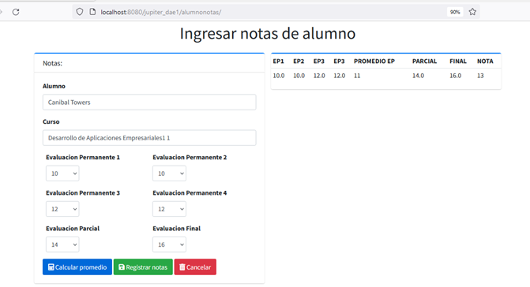
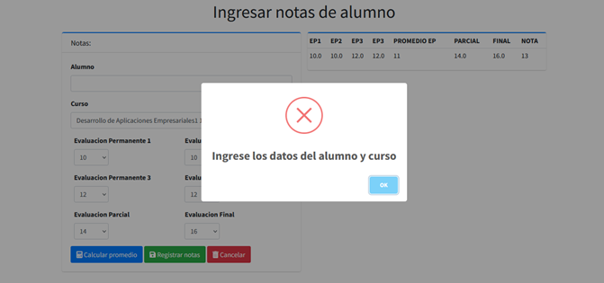
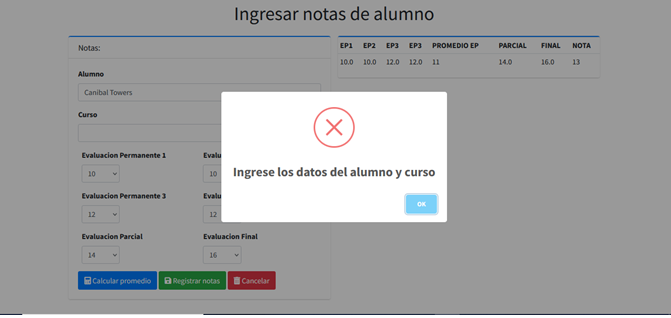
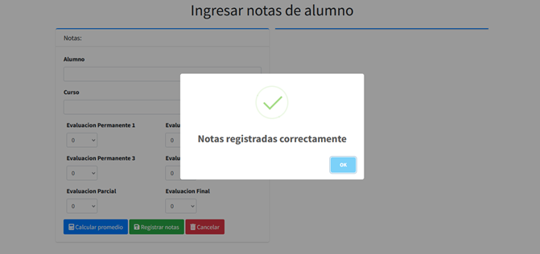
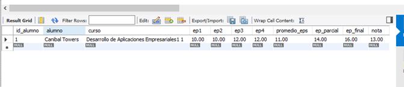

# PAGINA JAVA WEB:
Aplicacion para calcular el promedio de las notas del curso de programación.La escala de notas es de 0 a 20.
El esquema evaluativo es el siguiente con el peso respectivo:

1.Concepto	Peso:
Evaluación Permanente compuestas por 4 notas	40%
Examen Parcial	30%
Examen Final	30%

2.Para las evaluaciones permanentes tienen 4 notas con el siguiente peso:
•	Eva 1 - 25%
•	Eva 2 - 25%
•	Eva 3 - 25%
•	Eva 4 - 25%

Insertando datos:

Validando nombre del curso y del alumno:

Mensaje de Comprobación:

Verificando inserción en la BD:

